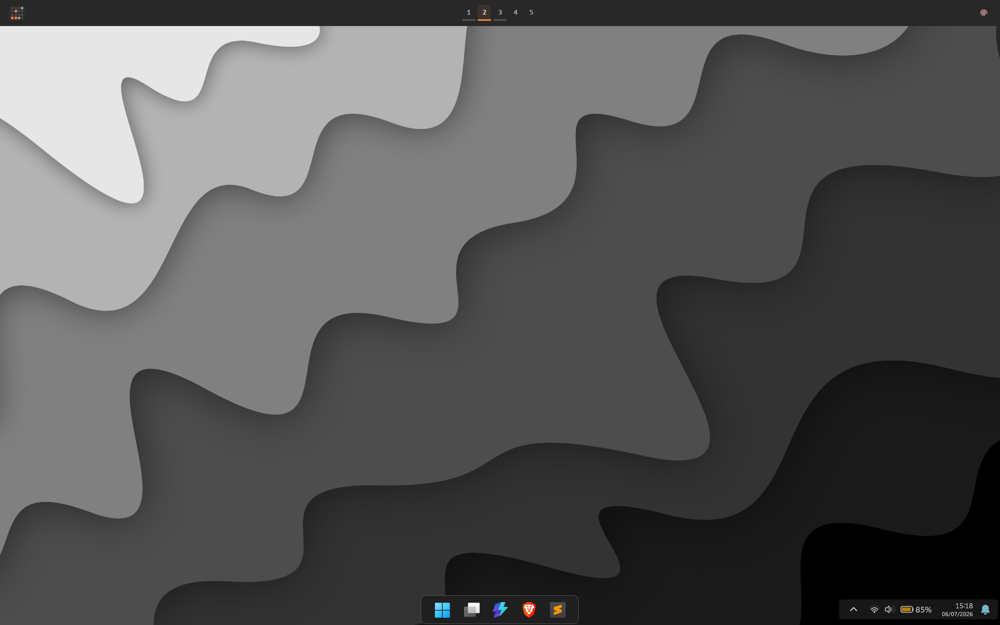
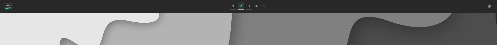
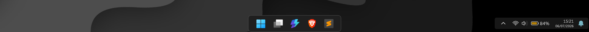

# GlazeWM + Zebar + Windhawk Setup

A minimalist GlazeWM workspace bar with Zebar, paired with a centered Windows 11 taskbar via Windhawk.





## Dependencies

| Tool | Version | Link |
|------|---------|------|
| **GlazeWM** | v3.7+ | https://github.com/glzr-io/glazewm |
| **Zebar** | v3+ | https://github.com/glzr-io/zebar |
| **Windhawk** | latest | https://windhawk.net |
| **Nerd Fonts** | v3+ | https://www.nerdfonts.com |

## Installation

### 1. GlazeWM

Copy `glazewm/config.yaml` to:

```
%USERPROFILE%\.glzr\glazewm\config.yaml
```

Then reload config: `Alt+Shift+A`

### 2. Zebar

Copy the `zebar/simple-ws/` folder into your Zebar widgets directory:

Option A — Via Zebar app: Import widget from `zebar/simple-ws/zpack.json`
Option B — Manual copy to `%USERPROFILE%\.glzr\zebar\simple-ws\`

Then run:
```
cd %USERPROFILE%\.glzr\zebar\simple-ws
npm install
npx zebar build
```

### 3. Windhawk (Taskbar Styler)

1. Install Windhawk
2. Install the **Windows 11 Taskbar Styler** plugin
3. Go to plugin settings → "Import from file"
4. Select `windhawk/theme.txt`

## Features

- Workspace indicator with accent-color per workspace
- Binary clock + normal date/time
- RGB / White / Dim / Blink / Workspace accent modes (click icon on right)
- Centered taskbar with centered notification area
- System tray integration
- Abstract grayscale wallpaper included

## Accent Modes

Click the icon on the right side of the bar to cycle:

| Icon | Mode | Description |
|------|------|-------------|
| 🎨 | RGB | Cycling hue animation |
| ☀️ | White | Solid white accent |
| 🌙 | Dim | Dim gray accent |
| 💡 | Blink | Smooth pulsing white |
| 🎯 | Workspace | Color per workspace (blue, orange, green, purple, red) |

## File Structure

```
├── glazewm/
│   └── config.yaml              # GlazeWM window manager config
├── zebar/
│   └── simple-ws/               # Zebar widget
│       ├── app.js               # Widget logic
│       ├── style.css            # Widget styles (3-color system)
│       ├── index.html           # Entry HTML
│       ├── zpack.json           # Zebar widget manifest
│       └── package.json         # Dependencies
├── windhawk/
│   └── file-win-plus-glaze-2.txt  # Windhawk Taskbar Styler config
├── screenshots/                 # Preview images
│   ├── full-desktop.png
│   ├── zebar.png
│   └── taskbar.png
├── wallpaper/                   # Included wallpaper
│   └── abstract-grayscale-layered-wavy-shapes.jpg
├── .gitignore
└── README.md
```

## License

MIT
